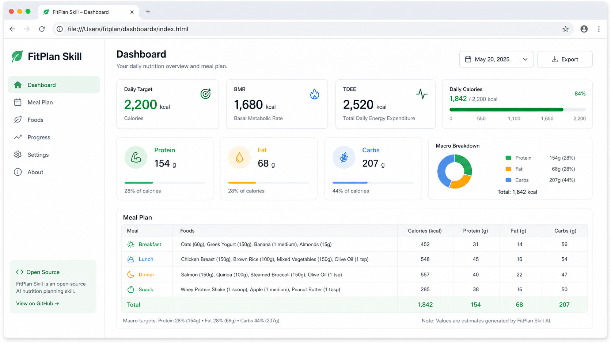

# FitPlan Skill

**言語:** [English](README.md) | [中文](README.zh-CN.md) | [Español](README.es.md) | [한국어](README.ko.md) | 日本語 | [العربية](README.ar.md)

FitPlan Skill は、ユーザープロフィールを、根拠の見えるカロリー目標、三大栄養素の目標、食事提案、ローカル HTML の栄養ダッシュボードへ変換する、プラットフォーム非依存の AI Skill 兼 TypeScript ツールキットです。

`SKILL.md` を読み込める AI アシスタント向け Skill としても、Web アプリ、CLI、Bot、Agent、バックエンドサービス向けの TypeScript ライブラリとしても利用できます。



_README のプレビュー画像は gpt-image-2 で生成したものです。_

> FitPlan Skill は、一般的なフィットネスと栄養計画のための MVP です。医学的な診断、治療、処方を行うものではありません。

## 主な機能

- Mifflin-St Jeor 式で BMR を計算します。
- PAL 活動係数で TDEE を推定します。
- `cut`、`bulk`、`maintain`、`glucose_control` の 4 つの目標に対応します。
- たんぱく質、脂質、炭水化物の目標量を自動で配分します。
- 同梱の中国語食品データベースから基本的な食事案を生成します。
- 食品重量の基準を、生重量、調理後重量、包装表示基準として明示します。
- 他のアプリや Agent が扱いやすい構造化 JSON を返します。
- オフラインで開ける単一ファイルのローカル HTML ダッシュボードをレンダリングします。

## 構成

FitPlan Skill は、再利用しやすい 3 つの層で構成されています。

| 層 | ファイル | 役割 |
| --- | --- | --- |
| Skill 指示 | `SKILL.md` | AI アシスタントの入力収集、計算、食事提案、出力を導きます。 |
| 計算エンジン | `src/` | BMR、TDEE、三大栄養素、食事生成の TypeScript 関数です。 |
| 表示層 | `templates/` / `src/render/` | ブラウザで開けるローカル HTML ダッシュボードを生成します。 |

## 使い方

```bash
npm install
npm test
npm run build
```

pnpm も利用できます。

```bash
pnpm install
pnpm test
pnpm run build
```

## AI Skill として使う

このリポジトリを対象ランタイムの Skills ディレクトリに配置し、アシスタントに `SKILL.md` を読み込ませます。ユーザーは自然な言葉で依頼できます。

```text
減量向けの食事プランを作ってください。男性、30歳、175cm、75kg、週4回トレーニングしていて、牛肉は食べません。
```

Skill は、プロフィール収集、BMR/TDEE/カロリー/三大栄養素の計算、構造化された食事案の生成、必要に応じたローカル HTML ダッシュボードの作成、臨床的または高リスクな状況への明確な注意喚起を支援します。

## TypeScript ライブラリとして使う

```ts
import { createFitPlan, createFitPageHtml } from "fitplan-skill";

const input = {
  profile: {
    sex: "male",
    age: 30,
    heightCm: 175,
    weightKg: 75,
    activityLevel: "moderate",
    goal: "cut"
  }
} as const;

const plan = createFitPlan(input);
const html = createFitPageHtml(input);
```

`createFitPlan` は、正規化されたプロフィール、BMR、TDEE、目標カロリー、三大栄養素、食事案、注意事項を返します。`createFitPageHtml` は、スタイルとデータを埋め込んだ完全な HTML 文字列を返し、CDN に依存しません。

## 入力形式

```ts
type UserProfile = {
  sex: "male" | "female";
  age: number;
  heightCm: number;
  weightKg: number;
  activityLevel: "sedentary" | "light" | "moderate" | "high" | "athlete";
  goal: "cut" | "bulk" | "maintain" | "glucose_control";
};
```

活動レベルは、座りがちな生活から高いトレーニング量までを表します。目標は、減量、増量、維持、血糖を意識した食事計画に対応します。

## 食品データと栄養ロジック

同梱の食品データベースは `assets/foods_zh.json` にあります。食品を追加する場合は、`id`、`nameZh`、`category`、`basis`、`servingUnit`、100g あたりの栄養成分フィールドを保ってください。`basis` は重量基準を示します。`raw` は生重量、`cooked` は調理後重量、`packaged` は包装の栄養表示基準です。

詳しい計算式は [docs/nutrition-logic.md](docs/nutrition-logic.md) に記載しています。既定の方針は、減量が `TDEE * 0.8`、増量が `TDEE * 1.1`、維持が `TDEE * 1.0`、血糖配慮では維持カロリーのまま炭水化物比率を控えめにする設計です。

## 健康上の注意

FitPlan Skill は、病気の診断、治療、管理を行いません。糖尿病または血糖降下薬を使用している方、腎臓・肝臓・心血管疾患がある方、妊娠中または授乳中の方、摂食障害の既往がある方、未成年者や高齢者、最近の手術後または重い病気からの回復期にある方は、食事を変更する前に医師または管理栄養士に相談してください。

## ライセンス

MIT
